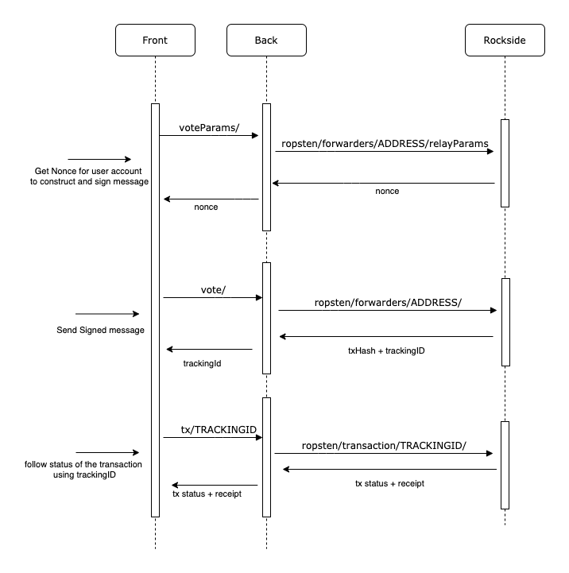

# Vote showcase
This demo application shows how to create a DApp that allows gaseless transactions with Metamask thanks to Rockside API.

*The use of Metamask is not a prerequisite, other solutions to sign the meta-tx can be implemented. Do not hesitate to [create issues](https://github.com/rocksideio/vote-showcase-app/issues/new) to request other examples of integrations for your use case.*

### How does it work ?



#### Pre-requisites

In order to relay meta transaction for a dApp, we need a Rockside Forwarder. This forwarder will be used by Rockside to forward meta transactions to the dapp contracts. See [the documentation](https://docs.rockside.io) for more information.

#### Dapp contract

The smart contract of this vote application if fairly simple. It manages a counter of "yes" and a counter of "no" votes. When an user wants to vote, he sends true to increment "yes" and false to increment "no".

```solidity
function relayExecute(address /* signer */, address /* to */, uint256 /* value */, bytes memory data) public {
	require(msg.sender == forwarder, "INVALID_SENDER"); // (1)
	bool decodedVote = abi.decode(data, (bool)); // (2)
	vote(decodedVote); // (3)
}
```

In order to be compatible with Rockside, we implement a simple `relayExecute` method. This methods receives a meta transaction and checks that the meta transaction comes from the forwarder contract. (1) Then it decodes the user's vote (2) and actually increments the correct counter (3).


#### Dapp frontend

The dapp frontend prepares the meta transaction by requesting a nonce and signing the meta transaction parameters (see /front/src/components/vote/Vote.ts). Then it sends the signed meta transaction to the Dapp backend.

#### Dapp backend

The dapp backend exposes 4 routes :

- `/setup`: This route sends all required information for the front to work. Basically, the vote contract address to interact with it (get yes/no votes count, prepare a meta transaction)
- `/voteParams`: This route sends information required to sign a vote meta transaction. To protect against replay attack, a nonce is needed when signing a meta transaction. This route returns a valid nonce that can be used by the user to sign a new meta transaction.
It uses [relay parameters](https://docs.rockside.io/rockside-api#get-relay-parameters) Rockside API.
- `/vote`: This route sends the given meta transaction to rockside to be relayed. It returns a Rockside tracking_id that can be used to follow the transaction (which could be replayed, so the transaction hash could change). It uses [transaction relay](https://docs.rockside.io/rockside-api#relay-a-transaction) Rockside API.

- `/tx/:trackingId`: This route allows the frontend to follow the status of a transaction using a Rockside tracking_id. It can be used to retrieve the final transaction receipt.  It uses [transaction tracking](https://docs.rockside.io/rockside-api#get-transaction-infos) Rockside API.
